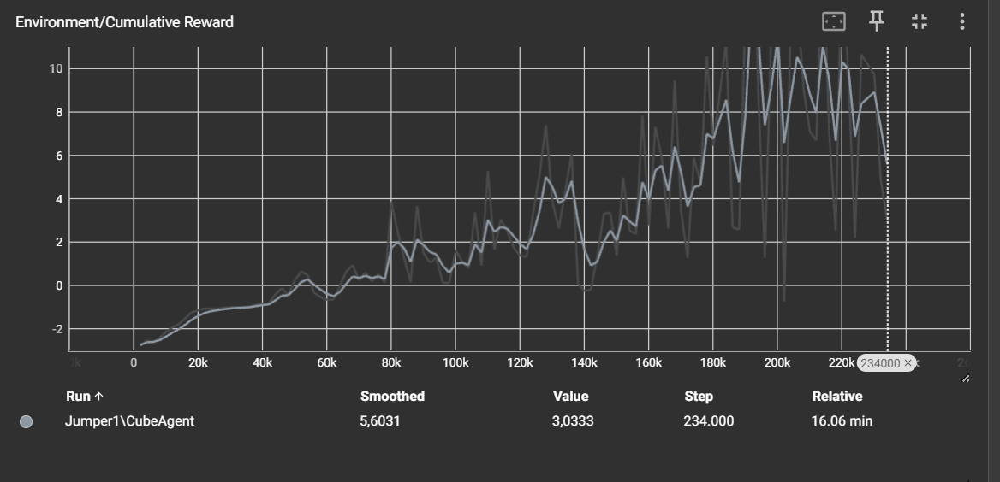

# ML AGENTS III - Jumper Exercise

## Project uitleg:

**Set-up:** Een jumper oefening waarbij een Agent (Kubus) over bewegend objecten moet springen.
**Goal:** De agent moet over de objecten springen zonder deze te raken.
**Agents:** Er wordt 1 agent gebruikt
**Agent Reward Function:**

- -1.0f bij elke aanraking met een object
- +1.0f bij elke aanraking van het object met de eindmuur => een succesvolle sprong

**Behavior Parameters:**

- Vector Observation space: One variable corresponding to current state.
- Actions: 1 discrete action branch with 3 actions (Move left, do nothing, move right).
- Visual Observations: None
- Float Properties:

  - Snelheid van de objecten

- Benchmark Mean Reward:

## Project Setup:

- Open Unity en maak een nieuw project aan.
- Zorg ervoor dat je de nieuwste versie van de Unity ML-Agents Toolkit hebt geïnstalleerd.
- Importeer de ML-Agents assets in je project.

## Environment Design:

Ontwerp een virtuele omgeving waarin een kubusagent over bewegende obstakels moet springen.
Creëer bewegende obstakels (bijv. platforms, balken) die continu heen en weer bewegen of roteren.
Plaats een kubusagent in de omgeving die moet leren om over de obstakels te springen.

## Agent Behavior:

Definieer het gedrag van de agent met behulp van machine learning.
Definieer de beloningen en straffen op basis van de agentacties. Beloon de agent bij succesvolle sprongen en bestraf bij botsingen met obstakels. Wij gebruiken -1 bij een foute sprong en + 1 bij een succesvolle sprong.

## Training Setup:

Stel de trainingsomgeving in met behulp van de ML-Agents Toolkit.
Definieer de observaties, acties en beloningen van de agent in de trainingsconfiguratie.
Configureer de hyperparameters van het gekozen machine learning-algoritme.

```yaml
hyperparameters:
  batch_size: 128
  buffer_size: 2048
  learning_rate: 0.0003
  beta: 0.05
  epsilon: 0.2
  lambd: 0.95
  num_epoch: 3
  learning_rate_schedule: linear
```

## Training:

Start de training van de agent in de omgeving.
Laat de agent herhaaldelijk de omgeving verkennen en leren om obstakels te ontwijken en op het juiste moment te springen.
Monitor de trainingsvoortgang en optimaliseer de agentprestaties indien nodig door de trainingsparameters aan te passen.

## Evaluatie:


Op TensorBoard zien we een opwaartse trend in de cumulatieve beloningen, wat aangeeft dat onze ML-agent geleidelijk beter wordt in zijn taak. Dit bevestigt dat de training succesvol verloopt en de agent zijn vaardigheden verbetert.
